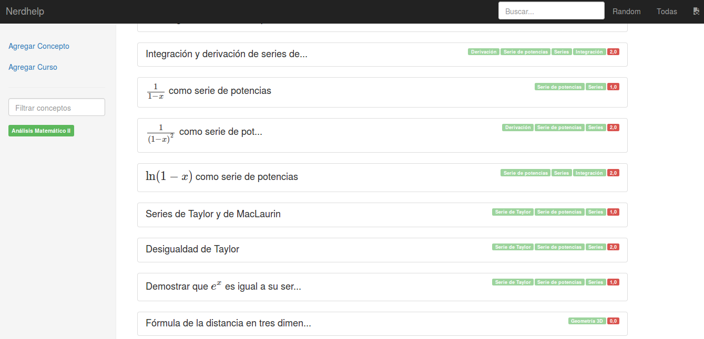

# nerdhelp

A django based web-app to help organizing your study. Only for obsessive nerds like me.

Create class notes, synopsis and recaps using rich text editor, latex support, embedding images and videos.

I developed it to organize my own class notes. So authentication mechanism is absent.
It's focused on organizing your knowledge on cards, tagging them, then using to prepare your exams.

## how to use it

Install [fades](https://github.com/PyAr/fades) (the only dependency)

- Create the containers with `make build`
- Apply migrations and create superuser with `make bootstrap`
- Run the app with `make run`
- Browse localhost:8080
